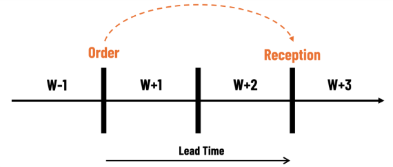
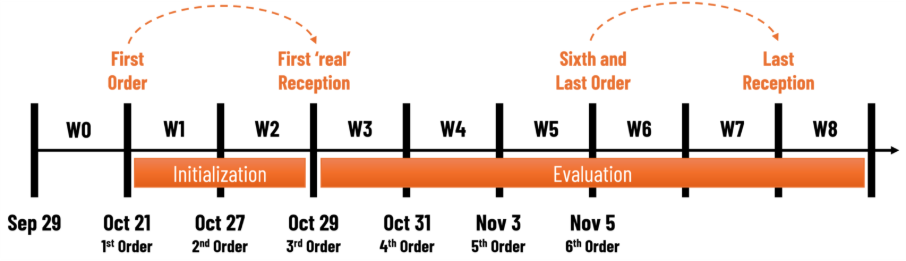

Description
Description of the competition
🧠 VN2 Inventory Planning Challenge 

Welcome to VN2, a supply chain competition that challenges participants to optimize inventory ordering decisions for grocery stores.  

Your goal: minimize shortage and holding costs. 

 

🗓️ The Scenario 

Today is Monday, April 15th, 2024. It’s early morning. You are the inventory planner of a retail chain. 

Every week before the store opens, you must place an order to your central warehouse, which will be delivered in two weeks. You know your current stock and incoming deliveries, and you have access to around three years of historical weekly sales and stock availability. 

You are now in charge. Your job is to place orders over six consecutive weeks to keep your stores well-stocked, avoiding lost sales and holding costs. 

Shape 

📦 Rules & Simulation Details 

Objective: Minimize total cost, computed as holding cost + shortage cost 
Holding Cost: 0.2€ per unit of inventory left at the end of a week 
(No holding cost for in-transit goods) 
Excess inventory is kept from one period to the next; there is no risk of waste, loss, or obsolescence.  
Shortage Cost: 1€ per unit of lost sales  
(There are no backorders — when a sale is missed, it’s lost) 
Review Period: You can place one order per week at the end of the week, before the next week starts. 
Lead Time: 2 weeks (orders are made at the end of week X and received at the start of week X+3 – so they are available for sales on week X+3). 
Supply: We assume that our supplier has infinite production capacity and stable lead times. 

 

⏱️ How the Simulation Works 

All participants start from the same initial conditions — same inventory and in-transit orders. All participants will play through the exact same sales sequence that is revealed step by step, at the same point in time for all participants. 

 

This sales sequence is based on actual sales from an anonymous company. 

 

Participants submit one order per week for six consecutive weeks (Rounds 1–6). 
Due to the 2-week lead time, the simulation will continue for another two weeks, as your final order (from Round 6) will only be delivered in Week 8. 

 

If no order is provided from a participant, the last order submission received will be used again.  

 

At the end of each round, participants will receive: 

Updated weekly sales data 
Their updated inventory state (starting and ending inventory position, status of in-transit orders) 
Shape 

📥 Submissions 

Participants submit their order quantities for all 599 products. The platform will validate the format of each submission. But, only the latest submission will be considered as your order. 

 

Submissions will be checked based on the following points,  

Submissions are .csv files with “,” as a separator 
Submissions have the same number of rows as sales data (599 rows), and the index (Store x Product) is exactly the same (with the same order). 
No negative orders, no missing orders
Shape 

📅 Timeline 

| Date (2025) | Event |
|-------------|------------------------------------------------------------|
| Sunday, Sep 28 23:59 UTC  |	Historical data released (historical sales, stock availability, and product hierarchy). |
| Tuesday, Oct 21 23:59 UTC |	Deadline to sign up for the competition. |
| Tuesday, Oct 21 23:59 UTC  |	Deadline to submit 1st order (using the available historical data). Week 1 - Shortly after, sales data and participants’ updated inventory states are published. Participants only receive information about their own state. All participants receive this at the same time. |
|Monday, Oct 27 23:59 UTC |	Deadline to submit 2nd order (using Week 1 data).  Week 2 - Shortly after, sales data and participants’ updated inventory states are published.  |
| Wednesday, Oct 29 23:59 UTC |	Deadline to submit 3rd order (using Week 2 data). Week 3 - Shortly after, sales data and participants’ updated inventory states are published.  |
| Friday, Oct 31 23:59 UTC |	Deadline to submit 4th order (using Week 3 data). Week 4 - Shortly after, sales data and participants’ updated inventory states are published.  |
| Monday, Nov 3 23:59 UTC |	Deadline to submit 5th order (using Week 4 data). Week 5 - Shortly after, sales data and participants’ updated inventory states are published.  |
| Wednesday, Nov 5 23:59 UTC |	Deadline to submit 6th order (using Week 5 data). Week 6 - Shortly after, sales data and participants’ updated inventory states are published.  Week 7 - Sales data and participants’ updated inventory states are published Week 8 - Sales data and participants’ updated inventory states are published |
 
Shape 

🏆 Prizes 

| Rank/Category | Prize (€) |
|---------------|-----------| 
|1st place overall |	5,000 | 
|2nd to 5th place |	1,500 |
|Lowest cost for a round (Round 3 to 8) |	1,000 | 
| Community Prize (Top notebook)* |	1,000 |
*As in VN1, the community prize will go to the most endorsed notebook. To avoid gaming the system, the exact rules for determining “most endorsed” will not be disclosed. 

Shape 

Shape  

📚 Research 

VN2 is the first public inventory planning competition. We intend to use the results for academic and applied research. 

 

The top 20 participants will be invited to a follow-up interview to discuss their models and approaches. 

 

We seek to explore: 

How forecasting accuracy impacts inventory performance? 
Which forecasting metrics correlate with better decisions 
Which types of inventory policies perform best 
Whether complex models outperform simple policies 
How effective traditional formulas (e.g., safety stock, newsvendor models) are in practice 
The value of specific practices: ABC/XYZ segmentation, outlier cleaning, etc. 
By participating, you agree to share your approach and insights if selected for interviews. 