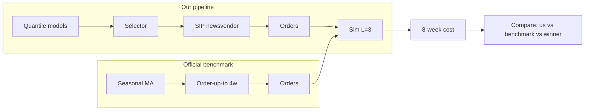

# VN2 Inventory Planning Challenge: Lessons Learned

**Data science meetup — 15–20 min**

Factual, constructive summary of what we built, how we performed, and what we’d do differently. Suitable for a short presentation with a slide or two on “what we’d do differently.”

---

## 1. Problem and goal

- **Competition**: VN2 Inventory Planning (DataSource.AI). Minimize total cost over **8 weeks** (6 ordering rounds + 2 delivery weeks).
- **Setup**: 599 SKUs (Store × Product); **L=3** lead time (order at end of week X arrives at start of week X+3); **asymmetric costs** (shortage €1/unit, holding €0.2/unit).
- **Goal**: Place one order per week; cost = holding + shortage each week; rank by cumulative cost.

---

## 2. What we built

- **Quantile forecasting**: Multiple models (ZINB, SLURP bootstrap, SLURP stockout-aware, LightGBM quantile, KNN profile, etc.) producing full predictive distributions.
- **SURD**: Systematic Unsupervised Representation Discovery for variance-stabilizing transforms per series.
- **Stockout awareness**: Censored demand during stockouts; imputation and stockout-aware SLURP.
- **SIP/newsvendor**: Stochastic Information Packet optimization — quantiles → PMF → integer order Q to minimize expected holding + shortage with correct L=3.
- **Model selector**: Per-SKU model chosen from historical (pinball/cost-based) performance.

---

## 3. Result

- **Our 8-week cost**: €7,787.40  
- **Rank**: 110th  
- **Winner**: €4,677  
- **Official benchmark**: Seasonal MA + 4-week order-up-to — we **did not beat it** on full 8-week cost.

---

## 4. Lead time: wrong L=2 vs L=3

- **Rule**: Order at end of week X arrives at start of week **X+3**. We implemented **L=2** (arrives week t+2).
- **Fix**: Corrected to L=3; added h=3 forecasts and `choose_order_L3()`.
- **Impact**: Only **~1.6% (€125)** improvement. Not the main cause of the gap.
- **Lesson**: Read the rules and encode them in tests. One-week sim or unit test with known demand would have caught L=2 vs L=3 early.

---

## 5. Forecast quality: main driver of the gap

- **Finding**: Primary cause of poor performance was **forecast quality**, not lead time or policy sophistication.
- **Lesson**: Forecast quality and calibration matter more than fancier optimization. Improve forecasts (and decision-aware evaluation) before adding complexity.

---

## 6. Benchmark: simple can win

- **Official benchmark**: Seasonal factors + 13-week moving average (point forecast) + order-up-to with 4 weeks coverage.
- **Lesson**: A simple, robust rule can beat a complex stack when our forecasts are worse. Benchmark early on the same actuals.

---

## 7. Density vs point

- We used **quantiles and newsvendor** (decision-aware); the benchmark used a **point forecast and order-up-to**.
- **Lesson**: Decision-aware evaluation (cost-based metrics, calibration) is the right yardstick for inventory. Point metrics (MAE, RMSE) can mislead.

---

## 8. Stockouts: censoring matters

- Demand during stockouts is **censored** (true demand ≥ observed sales). Treating stockouts as true demand biases training and policies.
- **Lesson**: Model the censoring (imputation, stockout-aware models); don’t treat stockouts as true demand.

---

## 9. End-to-end validation

- We fixed L=3 and improved the pipeline after the competition.
- **Lesson**: Backtest the **full pipeline** (forecast → orders → sim) early against a known benchmark. Catch lead time and horizon issues before submission.

---

## 10. AI agents: different objective

- The **forecast_agents** notebook (Claude, GPT, Gemini, Chronos, MLForecast) evaluates agents on **MASE/RMSE**, not inventory cost.
- **Lesson**: For inventory, the fair comparison is **cost-based**: plug agent forecasts into the same sim and compare 8-week cost. Accuracy metrics alone are not enough.

---

## What we’d do differently (slide)

1. **Get L=3 and h=3 right from the start** — and validate with a one-week sim.
2. **Benchmark early** — run official benchmark vs our pipeline on Week 1–2 (or historical) actuals.
3. **Prioritize forecast quality** — calibration, SURD, stockout handling; then selector and policy.
4. **End-to-end backtest** — full pipeline vs benchmark before the competition closes.
5. **Compare to agents on cost** — if using AI-generated forecasts, evaluate on 8-week cost, not only MASE/RMSE.

---

## Pipeline vs benchmark (optional diagram)

---

## References

- [L3_LEAD_TIME_ANALYSIS.md](L3_LEAD_TIME_ANALYSIS.md) — lead time bug and impact  
- [WHY_NOT_BEAT_BENCHMARK.md](WHY_NOT_BEAT_BENCHMARK.md) — root cause and benchmark comparison  
- [backtesting_against_competition.md](backtesting_against_competition.md) — methodology  
- [NEXT_TWO_WEEKS.md](NEXT_TWO_WEEKS.md) — action list for the next two weeks  
